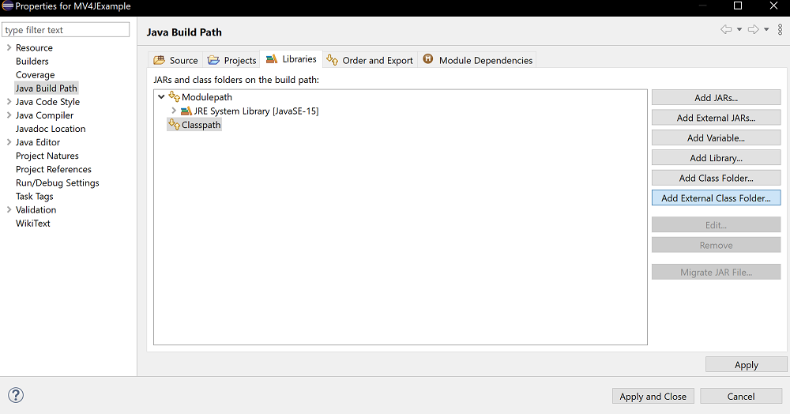

# Getting Start
This document will help you get started with MemoryVisualizer4J from downloading the library to starting use the visualizer.

## Download the release
First, download the library from the [Release Page on Github](https://github.com/caxerx/MemoryVisualizer4J/releases). Choice the `.jar` file on the release page and download it.


## Setup as dependency
After downloaded the library, you need to setup the library as dependency to use the MemoryVisualizer4J API. You only need to check the corresponding IDE section that you are using.

### IntelliJ IDEA
First, choice `File > Project Structure` on the menu bar.

  

Then, on the `Project Structure` Panel. Select `Project Setting > Libraries` and click on the  Button. Then select `New Project Library > Java`.

  

After that, select the MemoryVisualizer4J library file you just downloaded. Then click `OK`.
  

If you are asked for choose a module, select the your project name, and click `OK`.
  

Finally, click `OK` in the `Project Structure` Panel and back to the main page and you are finished the setup.

### NetBeans
First, create your project with option `Java with Ant > Java Application`

  

On the `Projects` Panel, select `Libraries > Add JAR/Folder`

  

After that, select the MemoryVisualizer4J library file you just downloaded. Then click `Open`. Then back to the main page and you are finished the setup.
  

### Eclipse
First, on the `Package Explorer`, Right Click and click `Properties`

  

On the `Properties` Panel, Select `Java Build Path > Libraries` and Choice `Classpath` on the list. Then click `Add External JARs...` 
  


After that, select the MemoryVisualizer4J library file you just downloaded. Then click `Open`. 
  

After that, click `Apply and Close` on the `Properties` Panel. Then back to the main page and you are finished the setup.

# Start Visualizer
To start use the visualizer, you can try this code snippet in your Java class.
```java
public static void main(String... args){
    MemoryVisualizer4J.getMemoryVisualizer()
                    .registerObject("Memory Visualize Test")
                    .visualize();
}
```

If you get error on the code, you may need to import the class of MemoryVisualizer. Add this line on the top of your class.

```java
import com.caxerx.memoryvisualizer4j.MemoryVisualizer4J;
```

Then, try to run the program, you should see these line appeared on your console. Access [http://localhost:20000](http://localhost:20000) to open the visualizer UI.

> Be aware, the url of the visualizer is **not** always `http://localhost:20000`, always check the url of the visualizer.

```
[main] INFO VisualizerWebServer - Visualizer Service started at: http://localhost:20000
[main] INFO VisualizerWebServer - Visualizer Service started. Application will not stop until manually terminate.
```

For more information about how to user the Visualizer UI, check [Introduce to Visualizer UI](./IntroduceToVisualizerUI)
