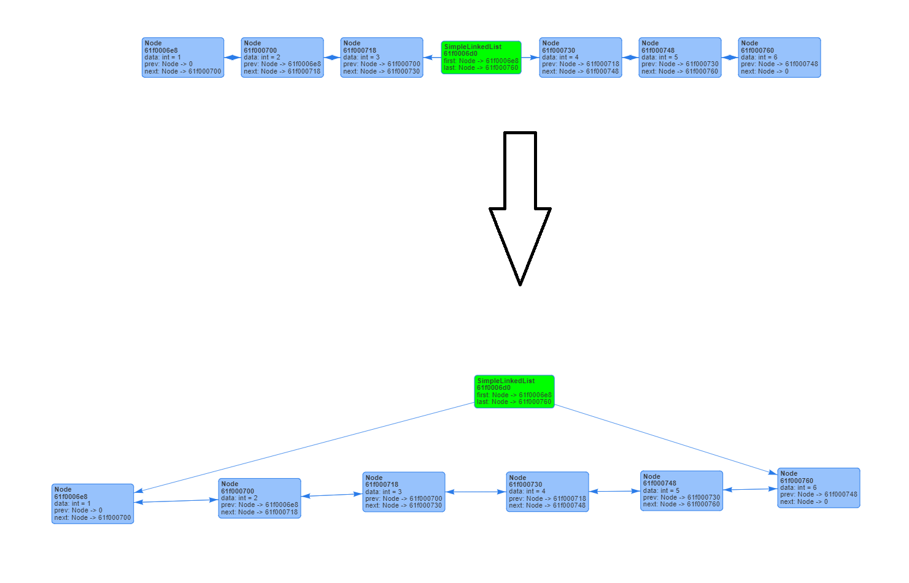

# Introduce to Visualizer UI
Welcome to the Visulizer UI of MemoryVisualizer4J. In this page, a full introduce of the Visualizer UI will be provided. Make sure you have checked the [Getting Start](./GettingStart) guide to setup your visualizer first.

## Main UI
  
This is the main UI of the Visualizer. 

### Switching between Table view and Diagram view
In the top toolbar, there is a switch  that you can toggle between diagram view and table view.

### Connectivity
In the top of left bar, there are the status about the connectivity between Java and Web UI. In most of the situation, you will see `Connected` in this section.

  

But in some of the situation. For example, you had stopped the Java Program. The Visualizer will show `Connecting` until you open the Java Program again.

  

In the status of `Connecting`, you will still able to check the previous visualized object in the UI.

### Selecting Object
In the bottom section of left bar, it will show all of the object you had visualized. Click on the object to view the layout of it.

  

In Diagram view, you will able to show multiple object at once. But in table view, only 1 object can be show in the table each time.

## Diagram View
  

In diagram view, you can select object and show it as a diagram. Multiple object can be select and show as a diagram.

### Add and Remove Object
Click the object in the left panel to add or remove the object in diagram. The selected object will be highlighted on the list.

  

  

### Moving Node
Sometimes the link of reference in the diagram will be overlapped. You can move the object node in Diagram View by dragging to the correct place.
  

### Reseting Layout
If you want to reset the diagram to default layout, Click the  button on the top bar of Diagram View.

  

### Converting Vertical and Horizontal Layout
Sometimes, object can be more suitable to show as a horizontal Layout. The layout can be switched on the top bar of Diagram View 

#### Example of Vertical Layout Diagram

  

#### Example of Horizontal Layout Diagram

  

### Exporting Diagram
If you wish to save the diagram, click the  Button on the top bar of Diagram View to save it.
> Be aware that the saved diagram will only be the visible area of your browser. Zoom-out the image to save whole diagram if your diagram is large.

## Table View
In Table view, you can view the details of the Object and Class Layout of the object. In addition, the padding and memory offset of each fields.

### Selecting Object
Same as Diagram View, select the object on the left bar to check the layout.

  

### Navigate the Object
In table view, you can navigate the nested object by clicking  in the left panel of table view.

Moreover, you can click the object and show the details of the object.

  

### Viewing Object Layout
By default, you will see the object layout after you selected a object in table view. If the type of fields in the object is Primitive type or String, the value will show in the table too.
> Be aware that if the type of fields is an Object, the memory address in the table is not the actual memory of that object. It is a offset address base on the base Object address. You need to navigate into that object and check the actualy memory address of an Object **on the top of table view**.

  

### Viewing Class Layout
By toggling the switch  on the top of table view, you can see the class layout of the current object that you are viewing.  

